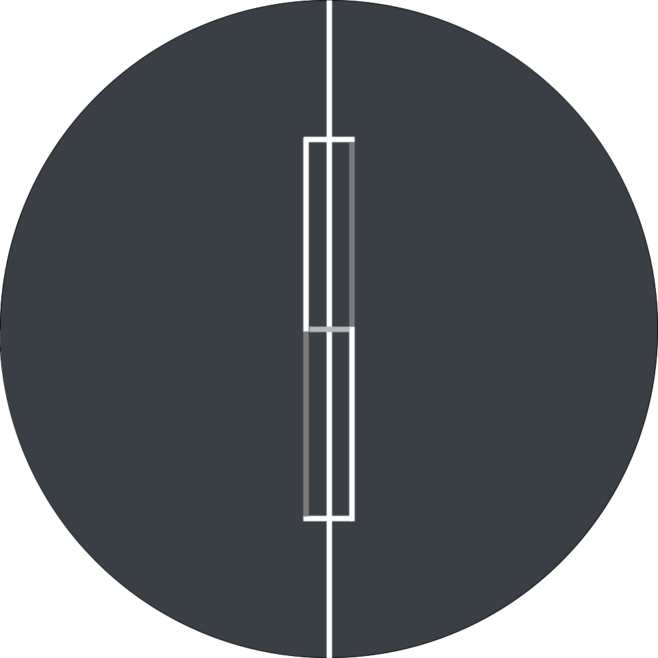

<p align="center">
  
</p>

# Sapient

Sapient is a multi-user portfolio monitoring system that combines shared market
data, personalized position context, deterministic monitoring, and LangGraph
agents. It monitors and advises; it does not connect to a brokerage or execute
trades.

## Current foundation

- Twelve Data 15-minute OHLCV ingestion with a rolling 150-candle history
- Supabase persistence behind a single database interface
- In-memory ticker/subscriber event routing
- Rate-limited, prioritized APScheduler refresh coordination
- Volatility-aware sharp-move detection with personalized thresholds
- Per-user LLM credentials required before agent execution
- Five implemented LangGraph agents with validated structured outputs
- Runtime handler registration, dynamic hypothesis scheduling, and portfolio-cycle
  coordination

## Five core agents

| Agent | Trigger | Responsibility |
|---|---|---|
| Sharp Move Investigation | Intraday threshold or volatility anomaly | Investigate a sudden move and explain its effect on the user's position |
| Cross-Portfolio Reasoning | Completion of a user update cycle | Identify correlations, concentration, and combined portfolio risk |
| Motive Reassessment | Weekly per subscription | Compare the user's stated reason for the position with current evidence |
| Proactive Hypothesis Generation | Dynamic per-ticker cadence | Look for developing patterns before they become obvious |
| Scheduled Position Review | Daily or weekly per subscription | Provide the routine general assessment and recommendation for an owned or watched stock |

The Scheduled Position Review Agent consumes the existing `scheduled_update`
event. It reviews recent price behaviour, cost basis, P&L, volatility, prior
updates, alerts, and relevant external context. It is the normal daily or weekly
review path and is distinct from event-driven sharp-move analysis.

All five agents use the API key belonging to the user whose position is being
analyzed. User credentials must never enter prompts, agent state, alerts, update
records, WhatsApp messages, logs, or LangSmith traces.

## Later: opportunity discovery

A separate Opportunity Discovery Agent is planned after the five core agents and
delivery surfaces are stable. It will scan a bounded market universe, filter
candidates quantitatively, and research only a small shortlist. It will produce
opportunities for further research with explicit catalysts and risks, not automatic
buy instructions.

Opportunity discovery is not included in the current five-agent count because it
requires separate market-data coverage, cost controls, ranking logic, licensing
review, and safety evaluation.

## Later: evaluation data and continuous improvement

Build a structured evaluation dataset from agent runs to improve the system over
time. Retain:

- Agent input conditions and final outputs
- Tools and sources used
- User feedback on usefulness and accuracy
- Subsequent stock movement after 1 hour, 1 day, and 5 days
- Prompt, graph, and model versions

Use this dataset to compare agent versions, reduce false alerts, improve research
quality, and verify that changes produce measurable gains. LangSmith will support
debugging and trace inspection; structured feedback and market outcomes will drive
long-term evaluation and improvement.

### Far-future experiment: smaller-model fine-tuning

As a highly speculative later phase, evaluate whether the accumulated, de-identified
dataset can fine-tune or distill a smaller open-weight model, potentially using a
Qwen-family backbone, for narrow and frequent agent decisions. Candidate tasks
include trigger classification, search-or-no-search routing, evidence sufficiency,
alert prioritization, and cadence selection.

The smaller model would handle repetitive decisions only when offline evaluation
shows that it can match an established frontier-model baseline. Complex research,
ambiguous cases, and final high-impact synthesis would continue to use a frontier
model. The goal would be to reduce inference cost and latency without accepting a
measurable quality regression. This work requires sufficient high-quality examples,
privacy review, licensing review, held-out evaluations, and rollback thresholds
before production use.

## Core flow

```text
Twelve Data → Supabase → Scheduler / Monitor → EventBus
    → per-user AgentContext → LangGraph agent → update / alert
    → WhatsApp and dashboard
```

See `AGENTS.md` for the complete architecture and planned build order.
